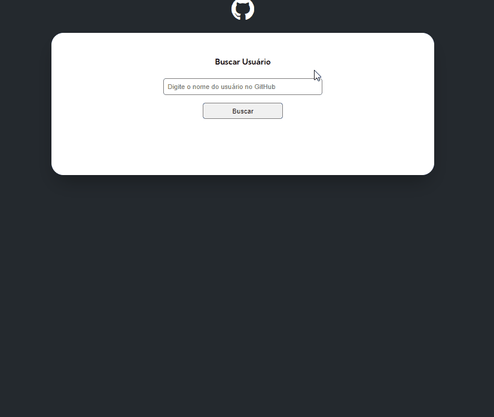
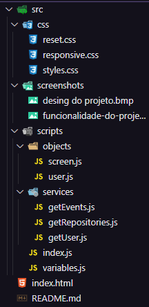

# Challenge - projeto mundo real com Fetch e GitHub

Esse é um exercício do curso [DevQuest](https://www.linkedin.com/school/devquest-dev-em-dobro/about/) sobre a [API Rest do GitHub](https://docs.github.com/pt/rest?apiVersion=2022-11-28).


## Sumário
- [Visão Geral](#visão-geral)
  - [O desafio](#o-desafio)
  - [Screenshots](#screenshots)
- [Meu processo](#meu-processo)
  - [Tecnologias utilizadas](#tecnologias-utilizadas)
  - [O que aprendi?](#o-que-aprendi-?)
  - [Desenvolvimento contínuo](#desenvolvimento-contínuo)
  - [Recursos úteis](#recursos-úteis)
- [Autor](#autor)


## Visão Geral

### O desafio

Os usuários devem ser capazes de:

- Pesquisar o nome de algum usuário do GitHub e visualizar seus dados
    - Foto de perfil
    - Nome de usuário
    - Biografia
    - Número de seguidores e seguidos
    - CheckEvents e PushEvents recentes
    - Alguns repositórios e dados sobre eles
- Visualizar os efeitos de ```hover``` ao passar o mouse sobre elementos interativos
- Visualizar mensagens de erro, caso o usuário não exista ou a barra de pesquisa esteja em branco.

### Screenshot



**Funcionalidade do projeto**

## Meu processo

### Built with

- HTML5
- CSS
- Flexbox
- JavaScript
- API

### O que aprendi?

Pude coletar dados da API do GitHub, além de ir mais a fundo ao coletar dados de usuários no GitHub, url da imagem de perfil, número de seguidores, biografia, nome de usuário, assim como seus eventos e repositórios e dados sobre eles.

Separei o arquivo de forma que fique organizado e que facilite a manutenção.



O arquivo index.js é responsável pela funcionalidade do projeto, ao adicionar os eventos de clique no botão e executar as funções que busca os dados do usuário digitado no input.

```js
async function getUserData(userName) {
    const userResponse = await getUser(userName);
    const repositoriesResponse = await getRepositories(userName);
    const eventsResponse = await getEvents(userName)

    if (userResponse.message === "Not Found") {
        screen.renderNotFound(user);
        return
        }
        
    console.log(repositoriesResponse);
    
    user.setInfo(userResponse);
    user.setRepositories(repositoriesResponse);
    user.setEvents(eventsResponse);

    screen.renderUser(user);
}
```

O botão de pesquisa executa essa função ao ser clicado. Além disso, foi adicionado um evento ao input que se a tecla Enter for clicada no teclado, o evento também é disparado. Assim a experiência do usuário fica melhor.

Na parta de objetos, criamos dois objetos que serão responsáveis por coletar somente os dados que queremos do usuário da [API Rest do GitHub](https://docs.github.com/pt/rest?apiVersion=2022-11-28) e não todos eles. O outro objeto é responsável por transmitir as informações na tela.

```js
const screen = {
    userProfile: document.querySelector(".profile-data"),
    renderUser(user) {
        this.userProfile.innerHTML =
            `
            <div class="info">
                
                <div class="data">
                    <h1>${user.name ?? "Não possui nome cadastrado 😢"}</h1>
                    <p>${user.bio ?? "Não possui bio cadastrada 😢"}</p>
                    <div class="follows">
                        <h2>Seguidores: <span>${user.followers}</span></h2>
                        <h2>Seguindo: <span>${user.following}</span></h2>
                    </div>
                </div>
            </div>
            `
    }
}
```
Também foi dividido por arquivos cada endpoint que solicita uma informação específica da API.

```js
import { baseUrl, repositoriesPerPage } from "/src/scripts/variables.js";

async function getRepositories(userName) {
    const response = await fetch(`${baseUrl}/${userName}/repos?per_page=${repositoriesPerPage}`);
    return await response.json();
}

export { getRepositories }
```
Por fim, foi criado variáveis que facilitem a alteração do projeto, caso seja necessário trocar o número de repositórios visualizados por página, por exemplo.

```js
const baseUrl = "https://api.github.com/users";
const repositoriesPerPage = 10;
const eventsPerPage = 10;

export { baseUrl, repositoriesPerPage, eventsPerPage }
```

A conciliação de todo os arquivos gera o resultado esperado.

### Desenvolvimento contínuo

Esse projeto foi bem desafiador, pois é necessário recorrer a vários dados de diferentes endpoints da nossa [API Rest do GitHub](https://docs.github.com/pt/rest?apiVersion=2022-11-28). O objetivo é avançar cada vez mais no uso de API's e bons códigos limpos ao utilizar JavaScript

### Recursos úteis

- [Responsive Viewer](https://chromewebstore.google.com/detail/responsive-viewer/inmopeiepgfljkpkidclfgbgbmfcennb) - Essa extensão do navegador nos ajuda a visualizar o projeto através das telas dos diversos dispositivos, assim, melhorar a responsividade. 
- [Auto rename tag](https://marketplace.visualstudio.com/items?itemName=formulahendry.auto-rename-tag) - Com essa extensão do VSCode é possível alterar, simultaneamente, o valor das tags HTML na sua abertura e fechamento, assim o processo de desenvolvimento do código é acelerado.
- [Live Server](https://marketplace.visualstudio.com/items?itemName=ritwickdey.LiveServer) - Extensão do VSCode que transmite automaticamente no navegador as alterações feitas no projeto, dispensando a necessidade de atualização da página.
- [Color HighLight](https://marketplace.visualstudio.com/items?itemName=naumovs.color-highlight) - Faz com que as cores escritas em RGB, RGBA, HSL e outros fiquem coloridas com a cor que as define. Assim facilita visualmente a seleção de cores no CSS.

## Author

- Linkedin - [FelipeSantiagoMorais](https://www.linkedin.com/in/felipe-santiago-873025288/)
- Frontend Mentor - [@SantiagoMorais](https://www.frontendmentor.io/profile/SantiagoMorais)
- GitHub - [SantiagoMorais](https://github.com/SantiagoMorais)
